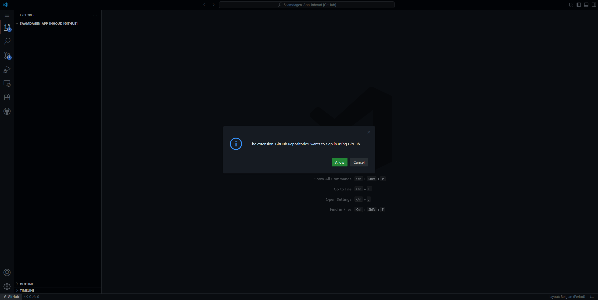
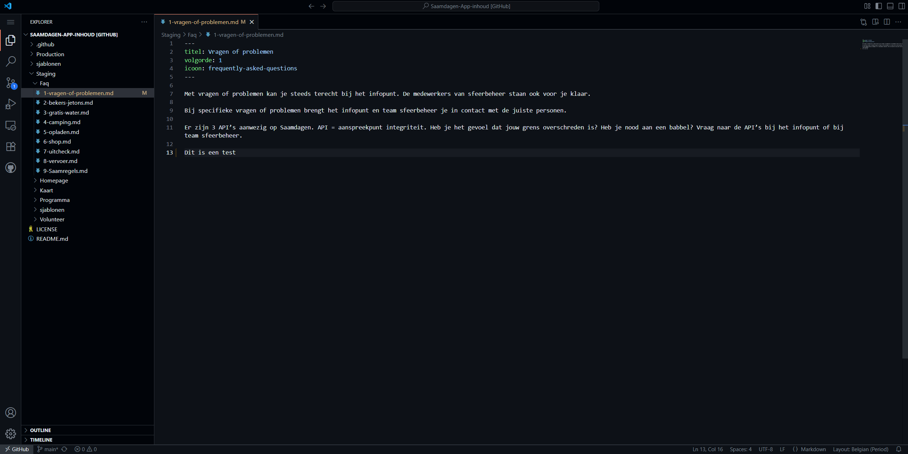
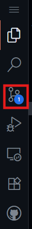
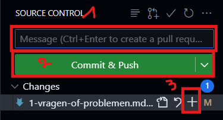

# Werking Git en VS Code

Hoe werk je nu best met [VS Code](https://code.visualstudio.com/) om de content aan te passen?

## Bronbestanden aanpassen

Om gemakkelijk de bestanden aan te passen, dien je naar de repository (waar alles staat) op GitHub te gaan (https://github.com/fosopenscouting/Saamdagen-App-inhoud), en dan op `.` te klikken op je toetsenbord.

Dit opent de GitHub web editor, zoals je hieronder kan zien.
Het is normaal dat er gevraagd wordt om in te loggen, doe dit ook met je account dat toegang heeft tot de repository.

Links, onder `Explorer` zal je dan al de broncode te zien krijgen.
Hier kan je dan bestanden aanpassen, door deze te zoeken in de lijst en erop te klikken. In het grote lege vak rechts kan je dan de inhoud wijzigen.

## Wijzigingen opslaan

Nadat je een aantal wijzigingen hebt gemaakt, zal je in de linkerbalk een blauw bolletje zien verschijnen.

Klik hierop om het menutje te openen. Hier krijg je dan een lijst met alle bestanden die je hebt aangepast en een aantal andere opties, hieronder meer uitleg erover.

1. De naam voor mee te geven aan de wijzigingen. bv `Programma SD 2025`
2. Sla de wijzigingen op.
3. Voeg deze wijzigingen toe aan de lijst voor op te slaan.

### Werkwijze

---

#### ➡️ Wil je alle aangepaste bestanden in 1x opslaan?

Geef dan direct je `Message` (1) in en druk op `Ctrl + Enter`. Zo worden je wijzigingen direct klaargezet voor op te slaan.

#### ➡️ Wil je slechts enkele aangepaste bestanden opslaan?

Druk naast elk bestand dat je wilt opslaan op het `+`-icoontje (3).

> [!NOTE]
> ℹ️ Je wijzigingen zijn nu `staged`.
> Je kan deze nog terug verwijderen door onder `Staged Changes` over de bestandsnaam te gaan met je muis en op het `-`-icoontje te klikken.
> Wat je aangepast hebt is dan nog niet verwijderd, maar het wordt dan niet meer opgeslagen.

Voer dan je `Message` (1) in.

---

Klik nu op de groene knop (2). De wijzigingen zullen direct worden gepubliceerd.

> [!CAUTION]
> Zorg dat je voor dat je het tabblad sluit alle wijzigingen hebt opgeslaan!
> Zoniet zal je alles kwijt zijn!
